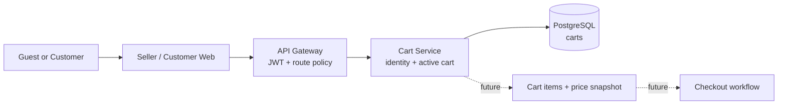

# Cart Service

<div align="center">
  

  <h2>Reliable cart ownership for every shopping journey</h2>

  <p>
    Cart lifecycle and active-cart identity for Bin E-Commerce guests and customers.
  </p>

  <p>
    
    
    
    
    
  </p>
</div>

## Why this service exists

A cart is more than a list of products: it must remain stable when a shopper refreshes a page, opens another tab, or moves from a guest session to an authenticated journey. Cart Service owns that identity boundary so the rest of the platform can work with one predictable active cart.

The current release establishes the cart aggregate and its ownership rules. Item lines, price snapshots, inventory checks, checkout transitions, and guest-to-customer merge are intentionally separated for later phases.

## What it does today

- Resolves an active cart for a **Customer** using the trusted user context forwarded by API Gateway.
- Resolves an active cart for a **Guest** using a validated UUID v4 session identifier.
- Creates an empty active cart when one does not exist.
- Guarantees one active cart per owner with a PostgreSQL partial unique constraint.
- Handles concurrent first requests safely: a losing request reads the cart created by the winning request.
- Exposes a lightweight health check and development-only Swagger documentation.

## Runtime trust boundary

> **Data and access:** this service writes only to its Cart Service PostgreSQL database (`carts` table). Public traffic should enter through API Gateway; the service consumes the Gateway-forwarded `x-user-id` or `x-session-id` identity headers and does not validate JWTs itself.
>
> **Secrets:** no OpenAI key or browser secret is used here. Database credentials are supplied through environment variables and must never be committed.
>
> **Reversibility:** the service is stateless outside PostgreSQL. In local development, stop the process before changing schema or removing disposable database data.

## Quick start

### Prerequisites

- Node.js 20+.
- A running PostgreSQL instance.
- A database created for this service (the example uses `bin_ecommerce_cart`).

### Install and run

```powershell
cd services/cart-service
npm install
Copy-Item .env.example .env
npm run dev
```

The API listens on `http://localhost:3003` by default. Swagger is available in development at `http://localhost:3003/docs`.

> **Before the first request:** make sure the database credentials in `.env` are valid and apply the migration in `src/database/migrations/202608280001-create-carts.ts` using the repository's migration workflow.

## See it work

Health check:

```powershell
curl http://localhost:3003/api/health
```

Resolve or create a guest cart through the service boundary:

```powershell
curl http://localhost:3003/api/v1/cart `
  -H "x-session-id: 00000000-0000-4000-8000-000000000001"
```

Resolve or create a customer cart (normally sent by API Gateway):

```powershell
curl http://localhost:3003/api/v1/cart `
  -H "x-user-id: customer-id-from-gateway"
```

The response is deliberately small in Phase 1:

```json
{
  "id": "<cart-id>",
  "ownerType": "GUEST",
  "ownerId": "<session-id>",
  "status": "ACTIVE",
  "items": [],
  "totalItems": 0,
  "warnings": [],
  "createdAt": "2026-08-29T10:00:00.000Z",
  "updatedAt": "2026-08-29T10:00:00.000Z"
}
```

## How it fits the platform



The service owns cart identity and lifecycle. API Gateway owns external authentication and routing. Product, inventory, pricing, and checkout remain separate domains and should be queried through explicit contracts rather than imported into this service.

## Project structure

```text
services/cart-service/
├── src/
│   ├── database/
│   │   ├── entities/cart.entity.ts       # Cart persistence model
│   │   └── migrations/                   # Versioned schema changes
│   ├── modules/
│   │   ├── cart/
│   │   │   ├── cart.controller.ts        # HTTP adapter: GET active cart
│   │   │   ├── repositories/             # Persistence boundary
│   │   │   ├── services/                 # Identity and cart use cases
│   │   │   ├── enums/                    # Cart lifecycle values
│   │   │   ├── errors/                   # Domain-facing errors
│   │   │   └── types/                    # Request/response contracts
│   │   └── health/                       # Runtime health endpoint
│   ├── app.module.ts                     # Module composition
│   └── main.ts                           # HTTP bootstrap and platform config
├── .env.example
├── package.json
└── README.md
```

## API reference

| Method | Route | Purpose | Identity |
| --- | --- | --- | --- |
| `GET` | `/api/v1/cart` | Get or create the active cart | `x-user-id` or UUID v4 `x-session-id` |
| `GET` | `/api/health` | Report HTTP and PostgreSQL readiness | None |

`x-user-id` takes precedence when both headers are present. A missing customer identity and an invalid guest session are rejected instead of creating an ambiguous cart.

## Cart lifecycle

```text
ACTIVE ────────────────> CHECKED_OUT
   └───────────────────> ABANDONED
```

Only `ACTIVE` carts are created or returned by the current endpoint. The other states reserve explicit transitions for checkout and abandonment workflows.

## Development commands

```powershell
npm run dev          # Watch mode for local development
npm run build        # Compile the NestJS application
npm run start        # Run the compiled application
npm run type-check   # TypeScript validation without emitting files
npm test             # Jest unit tests
npm run lint         # ESLint with automatic fixes
```

For a production-like check, run `npm run build`, then `npm run start` with `NODE_ENV=production` and a dedicated database configuration.

<details>
<summary><strong>Design notes</strong></summary>

### Ownership and idempotency

The resolver normalizes Gateway headers into a domain identity. The query service first reads an existing active cart, then creates one inside a transaction. The database constraint is the final concurrency guard; when two initial requests race, the unique-violation path reads the already-created cart instead of returning a duplicate.

### Why items are not here yet

Phase 1 intentionally avoids mixing product, inventory, and pricing policy into cart creation. A future item use case can add immutable price snapshots, quantity validation, product availability checks, and checkout handoff without changing the ownership contract.

</details>

<details>
<summary><strong>Roadmap</strong></summary>

- Add and remove cart items with product ownership and availability checks.
- Persist quantity and price snapshots so cart totals are auditable.
- Merge a guest cart into the customer's cart after sign-in.
- Add checkout and abandonment transitions with explicit idempotency keys.
- Publish cart events for analytics and notification workflows.

</details>

## Contributing

Keep controllers thin, keep cart rules inside the Cart module, and add a focused test when changing ownership or lifecycle behavior. Changes that cross service boundaries should be documented with an API contract or an Architecture Decision Record.

## License

This service is part of the Bin E-Commerce monorepo. Refer to the repository root for project-wide licensing and contribution terms.
